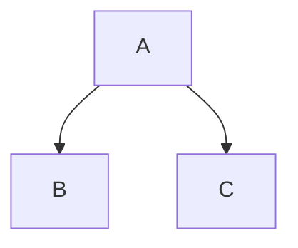
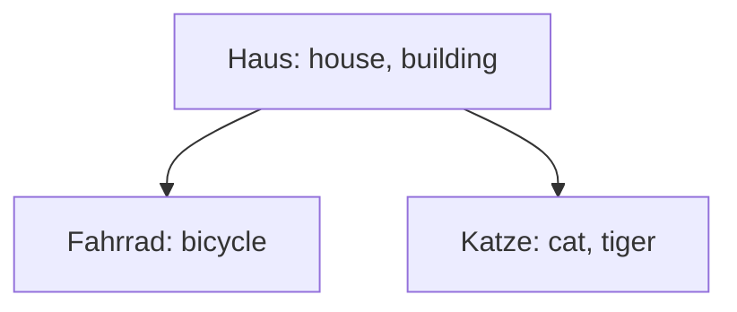

# Aufgaben zu binären Suchbäumen

## Aufsuchen von Elementen

Schreiben Sie eine Methode `Get()` für den Element-Datentyp.
Die Funktion soll einen String erwarten, das Element aufsuchen, das diesen String als
`Key` hat und einen Pointer auf dessen Datensatz liefern.
Gibt es kein solches Element, soll `nil` geliefert werden.

## Nachschlagen von Daten zu einem Schlüssel

Schreiben Sie eine Funktion `GetValue()` für den Element-Datentyp.
Die Funktion soll einen `Key` erwarten und die entsprechenden Daten aus dem Baum
heraussuchen.

## Anzahl der Elemente

Schreiben Sie eine Methode `Size()` für den Element-Datentyp.
Die Funktion soll die Anzahl der nicht-leeren Elemente liefern, die der Baum
unter dem Element hat.

## Höhe des Baumes

Schreiben Sie eine Methode `Height()` für den Element-Datentyp.
Die Funktion soll die Anzahl der Elemente liefern, die auf dem längsten Pfad
vom Wurzel-Element zu einem der Blätter liegen.

## Optimierung der `Add()`-Methode

Schreiben Sie die Methode `Add()` des Element-Datentyps so um, dass sie *Tail-Recursion*
verwendet. D.h. es soll nur einen einzigen rekursiven Aufruf geben und dieser soll ganz
am Ende der Funktion stehen.

## Baum-Datentyp

Erstellen Sie einen Container-Datentyp, der einen Baum repräsentiert.

Gehen Sie analog zum Container-Datentyp bei verketteten Listen vor.
Der Container soll einen Pointer auf die Wurzel enthalten.
Die Zugriffsfunktionen sollten an die Wurzel delegieren.

Sie müssen nicht alle Methoden aus dem Element-Datentyp für den Baum übernehmen.
Es genügen zunächst die Methoden `Add()` und `GetValue()`.
Außerdem soll es einen Konstruktor für den neuen Baum geben.

**Anmerkung:** Der bisherige Element-Datentyp repräsentiert auch schon einen Baum.
Soweit wie der Baum bisher implementiert ist, ist das auch ausreichend.
Für die folgenden Aufgaben wird es aber hilfreich sein, einen Baum-Datentyp
zu haben, der die Elemente vor dem Client-Programmierer versteckt.

## Ausgabe von Bäumen erweitern: Mermaid-String generieren

Fügen Sie eine Funktion zum Baum hinzu, die den Baum als Mermaid-Graph ausgibt.

Mermaid ist ein Text-Format, mit dem man Diagramme beschreiben kann,
die dann z.B. als PDF oder in Browsern gerendert werden können.

**Beispiel 1:**
Ein einfacher Baum in Mermaid mit einem Knoten `A` als Wurzel,
`B` als linkem und `C` als rechtem Kind:

**Beispiel 2:**
Der gleiche Baum wie in Beispiel 1, allerdings wurden
den Knoten hier noch Labels gegeben:

**Links zu Mermaid:**

- [Beschreibung zu Mermaid](https://mermaid-js.github.io)
- [Online-Editor für Mermaid](https://mermaid.live)
- [Beispiel 1 im Online-Editor](https://mermaid.live/edit#pako:eNpNj0EOgjAQRa8ymTVeoAsTEI2JS91RF0M7QBMopEwXSLi7NWLiX83kvcX_K5rRMipsA00dPErtISWvrhRnBd0YZ86gjq63zrfPLy2qC3UhkFVQO7OYnndwqm4kL1ZgSDIQ13LYSQ6HwxGK_-ekPWY4cBjI2dRg_UCN0vHAGlU6LTcUe9Go_ZbUOFkSPlsnY0DVUJ-qIUUZ74s3qCRE_kmlozRo2K3tDVikSb4)
- [Beispiel 2 im Online-Editor](https://mermaid.live/edit#pako:eNpNj0EOgjAQRa8ymTVeoAsTEI2JS91RF0M7QBMopEwXSLi7NWLiX83kvcX_K5rRMipsA00dPErtISWvrhRnBd0YZ86gjq63zrfPLy2qC3UhkFVQO7OYnndwqm4kL1ZgSDIQ13LYSQ6HwxGK_-ekPWY4cBjI2dRg_UCN0vHAGlU6LTcUe9Go_ZbUOFkSPlsnY0DVUJ-qIUUZ74s3qCRE_kmlozRo2K3tDVikSb4)

## Löschen von Elementen

Implementieren Sie das Löschen von Elementen aus dem Baum, wie es in der Vorlesung
besprochen wurde.

Schreiben Sie eine Methode `Remove()` für den Baum-Datentyp.
Die Funktion soll einen `Key` erwarten und das Element mit diesem `Key` suchen und
aus dem Baum entfernen.

Ist das zu löschende Element ein Blatt, kann es direkt entfernt werden.
Hat es nur ein Kind, kann es einfach überbrückt werden.
Ist es ein "echter" innerer Knoten, muss sein In-Order-Nachfolger oder -Vorgänger
gesucht und das Element damit vertauscht werden. Anschließend muss es rekursiv
von seiner neuen Position entfernt werden.

## Rück-Übersetzung

Implementieren Sie eine Methode für den Baum, die ein englisches Wort erwartet
und das entsprechende deutsche Wort liefert.

Welche Komplexität hat diese Methode?
