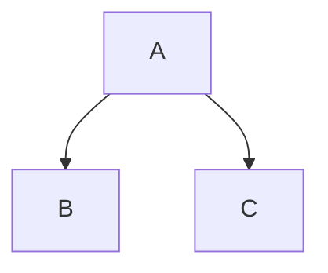
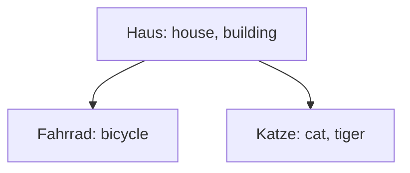

# Aufgaben zu binären Suchbäumen

## Aufsuchen von Elementen

Schreiben Sie eine Methode `Get()` für den Element-Datentyp.
Die Funktion soll einen String erwarten, das Element aufsuchen, das diesen String als
`Key` hat und einen Pointer auf dessen Datensatz liefern.
Gibt es kein solches Element, soll `nil` geliefert werden.

## Optimierung der `Add()`-Methode

Schreiben Sie die Methode `Add()` des Element-Datentyps so um, dass sie *Tail-Recursion*
verwendet. D.h. es soll nur einen einzigen rekursiven Aufruf geben und dieser soll ganz
am Ende der Funktion stehen.

## Ausgabe von Bäumen erweitern: Mermaid-String generieren

Fügen Sie eine Funktion zum Baum hinzu, die den Baum als Mermaid-Graph ausgibt.

Mermaid ist ein Text-Format, mit dem man Diagramme beschreiben kann,
die dann z.B. als PDF oder in Browsern gerendert werden können.

**Beispiel 1:**
Ein einfacher Baum in Mermaid mit einem Knoten `A` als Wurzel,
`B` als linkem und `C` als rechtem Kind:

**Beispiel 2:**
Der gleiche Baum wie in Beispiel 1, allerdings wurden
den Knoten hier noch Labels gegeben:

**Links zu Mermaid:**

- [Beschreibung zu Mermaid](https://mermaid-js.github.io)
- [Beispiel 1 im Online-Editor]()
- [Beispiel 2 im Online-Editor]()
